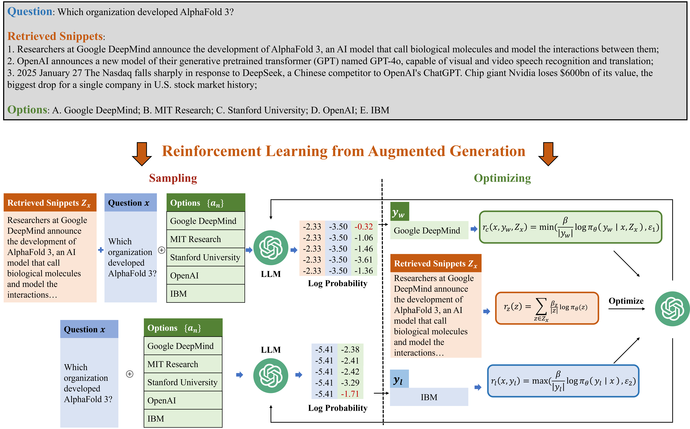

# Embedding-Domain-Knowledge-for-Large-Language-Models-via-RLAG

Large language models (LLMs) often exhibit limited performance on domain-specific tasks due to the natural disproportionate representation of specialized information in their training data and the static nature of these datasets. Knowledge scarcity and temporal lag create knowledge gaps for domain applications. While post-training on domain datasets can embed knowledge into models, existing approaches have some limitations. Continual Pre-Training (CPT) treats all tokens in domain documents with equal importance, failing to prioritize critical knowledge points, while supervised fine-tuning (SFT) with question-answer pairs struggles to develop the coherent knowledge structures necessary for complex reasoning tasks. To address these challenges, we propose Reinforcement Learning from Augmented Generation (RLAG). Our approach iteratively cycles between sampling generations and optimizing the model through calculated rewards, effectively embedding critical and contextually coherent domain knowledge. We select generated outputs with the highest log probabilities as the sampling result, then compute three tailored reward metrics to guide the optimization process. To comprehensively evaluate domain expertise, we assess answer accuracy and the rationality of explanations generated for correctly answered questions. Experimental results across medical, legal, astronomy, and current events datasets demonstrate that our proposed method significantly outperforms baseline approaches.

The *Knowledge Base Creation* folder contains the relevant code files for using the retriever to build the knowledge base
The *RLAG* folder contains the model training and evaluation code files involved in the paper.

IF YOU THINK THIS REPO IS HELPFUL, PLEASE GIVE A STAR!